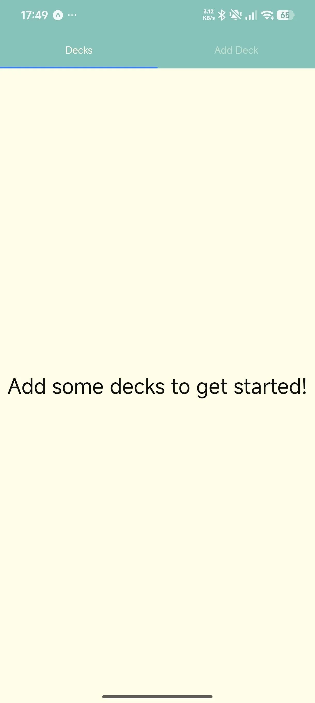
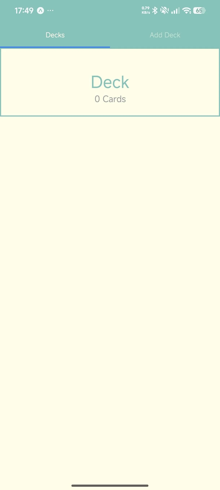
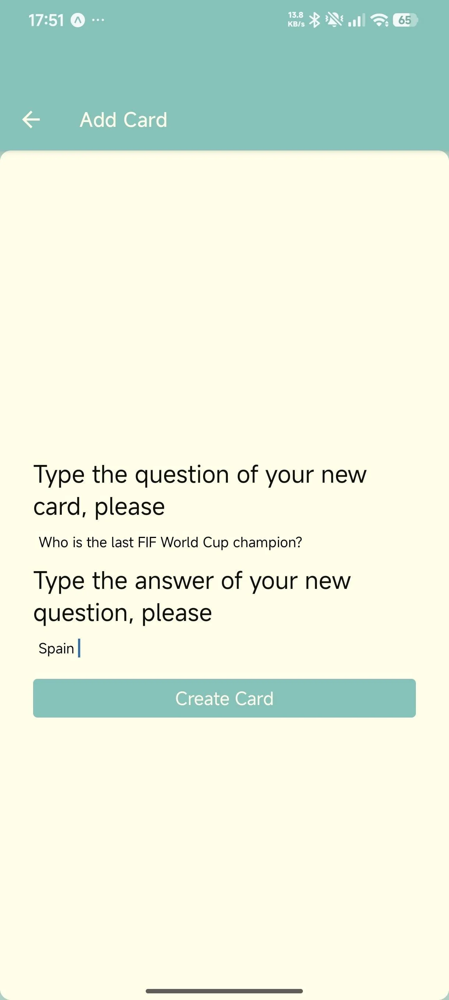
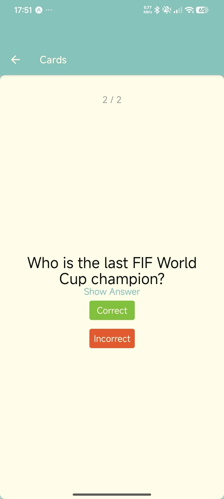
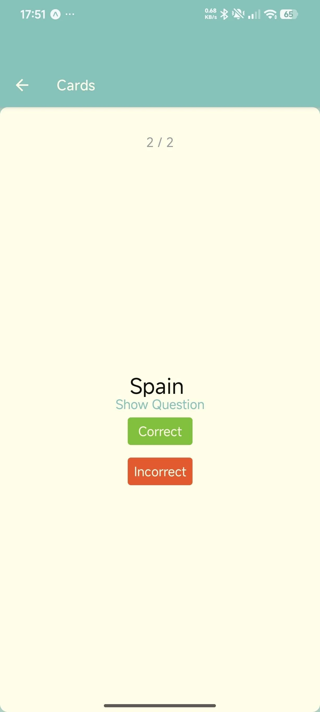
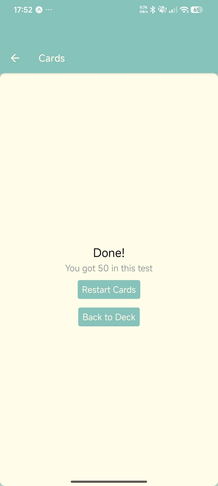

# UdaciCards

[](https://expo.dev/)
[](https://reactnative.dev/)
[](https://reactnavigation.org/)
[](https://redux.js.org/)
[](https://styled-components.com/)
[](https://pnpm.io/)

A mobile flashcard app built with React Native and Expo. Create decks of question/answer cards, quiz yourself, and track your score. A daily notification reminds you to study.

---

## 📸 Screenshots

| Home | Add Deck |
|---|---|
|  |  |

| Add Card | Quiz Question | Quiz Answer | Results |
|---|---|---|---|
|  |  |  |  |

---

## 💎 Value Proposition

- **Deck management** — create named decks and add question/answer cards to them, persisted to `AsyncStorage` and mirrored in a Redux store.
- **Interactive quiz** — flip through flashcards one-by-one, mark answers correct or incorrect, and review your score at the end.
- **Daily reminder** — an 8 PM local notification nudges you to study, cleared when you complete a quiz.
- **Tabbed navigation** — Material top tabs on the home screen (Decks / Add Deck) and native stack navigation for deck detail, card creation, and quiz flow.

> ⚠️ **Class-component codebase.** This project uses class components (`Component` / `PureComponent`) throughout — no hooks. It was the final assessment for Udacity's React Native course, migrated from Create React Native App (2018) to modern Expo + pnpm.

---

## 📦 Installation

**Prerequisites:** [Node.js](https://nodejs.org/) >= 20, [pnpm](https://pnpm.io/installation) >= 10, and the [Expo Go](https://expo.dev/go) app on a physical device (or an Android emulator / iOS simulator).

> ⚠️ This project is **excluded from the monorepo's pnpm workspace** on purpose (see the root `pnpm-workspace.yaml`). It has its own lockfile and `node_modules`; always install and run it from *this* directory, never from the repo root.

```bash
cd packages/02-udacicards
pnpm install
```

---

## 🚀 Usage

| Command | Description |
|---|---|
| `pnpm start` | Start the Metro dev server; scan the QR code with Expo Go |
| `pnpm run android` | Start and open on a connected Android device/emulator |
| `pnpm run ios` | Start and open on the iOS simulator (macOS only) |
| `pnpm test` | Run the Jest smoke test (`jest-expo` preset) |

On first launch the app schedules a daily 8 PM quiz reminder via `expo-notifications`.

---

## 🏗️ Architecture

```
├── App.js                        # Redux Provider + NavigationContainer
├── index.js                      # Entry: registerRootComponent(App)
├── src/
│   ├── components/
│   │   ├── Deck/
│   │   │   ├── Deck.component.js       # Single deck detail view
│   │   │   ├── Decks.component.js      # Home screen: FlatList of all decks
│   │   │   └── NewDeck.component.js    # Form to create a new deck
│   │   ├── Card/
│   │   │   ├── Card.component.js       # Flashcard (question/answer toggle)
│   │   │   ├── Cards.component.js      # Quiz flow controller + results
│   │   │   ├── NewCard.component.js    # Form to add a question/answer card
│   │   │   ├── Answer.component.js     # Answer text display
│   │   │   └── Question.component.js   # Question text display
│   │   ├── CardsStatusBar/
│   │   │   └── CardsStatusBar.component.js  # Custom status bar
│   │   ├── TextButton/
│   │   │   └── TextButton.component.js      # Reusable styled button
│   │   └── index.js                  # Barrel exports
│   ├── navigation/
│   │   └── index.js                  # Stack + Material Top Tab navigators
│   ├── redux/
│   │   ├── store.js                  # Store creation (standalone)
│   │   ├── actions/
│   │   │   ├── cards.action.js       # answerCard, resetCards, startCards
│   │   │   ├── decks.action.js       # receiveDecks, addDeck, addCard, deleteDeck
│   │   │   └── types.action.js       # Action type constants
│   │   └── reducers/
│   │       ├── cards.reducer.js       # Quiz state (currentQuestion, correct count)
│   │       ├── decks.reducer.js       # Decks state (deck objects with questions arrays)
│   │       └── index.js              # combineReducers
│   └── utils/
│       ├── api.js                    # AsyncStorage CRUD for decks/cards
│       ├── colors.js                 # Color palette constants
│       └── notification.js           # Daily 8 PM quiz reminder scheduling
├── assets/                           # App screenshots (WebP)
└── app.json                          # Expo configuration
```

### 📊 Data Flow

1. **`Decks`** mounts, fetches decks from `AsyncStorage` (`udacicards:deckstorge` key), dispatches `receiveDecks` to Redux.
2. The deck store shape is `{ [title]: { title, questions: [{ question, answer }] } }`. Two seed decks (React, JavaScript) are hardcoded in `api.js` but only returned when storage is empty.
3. **`NewDeck`** / **`NewCard`** persist to `AsyncStorage` and dispatch `addDeck` / `addCard` to Redux, then navigate back.
4. **`Cards`** (quiz) tracks `currentQuestion` and `correct` count in Redux. Each Correct/Incorrect press dispatches `answerCard`. When all cards are answered, a results screen shows the score percentage.
5. **`Deck`** clears existing notifications and reschedules the daily reminder when a quiz starts, so the user isn't nudged on days they already studied.

### 🧭 Navigation

```
Stack Navigator
├── Home (Material Top Tabs)
│   ├── Decks tab
│   └── Add Deck tab
├── Deck (detail)
├── Add Card
├── Cards (quiz)
└── Card (individual flashcard)
```

---

## ⚙️ Configuration

### 📱 Expo

`app.json` holds the Expo config (name, slug, orientation, `expo-notifications` plugin, iOS bundle id / Android package). There is no `sdkVersion` field — the SDK is implied by the installed `expo` package.

### 🧭 Metro

`metro.config.js` disables Expo's monorepo autodetection (`EXPO_NO_METRO_WORKSPACE_ROOT=1`) and pins `resolver.nodeModulesPaths` to this project's own `node_modules`, so Metro never resolves packages from the monorepo root (where the web projects hoist react 18).

### 📦 pnpm isolation

`pnpm-workspace.yaml` in this directory makes it its own pnpm workspace with `nodeLinker: hoisted` and `autoInstallPeers: false`. The latter prevents `styled-components` from dragging in a `react-dom` peer that would pull a mismatched React copy. A `packageExtensions` entry declares the missing `react-native` peer for `styled-components`.

### 🔔 Notifications

`expo-notifications` schedules a daily 8 PM local reminder. The notification is cleared and rescheduled after each completed quiz. iOS Expo Go and development builds support local scheduled notifications; remote push is unavailable in Expo Go on Android since SDK 53.

---

## 🤝 Contribution

1. Fork the repository and create a feature branch.
2. Install dependencies from *this* directory with `pnpm install`.
3. Verify changes with `pnpm test`.
4. Follow the existing folder structure and class-component patterns.
5. Do not re-add this project to the root pnpm workspace without solving the react 18/19 hoist conflict first.
